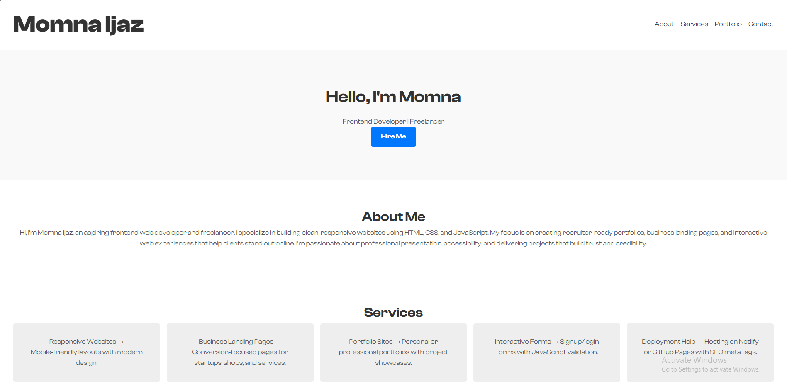
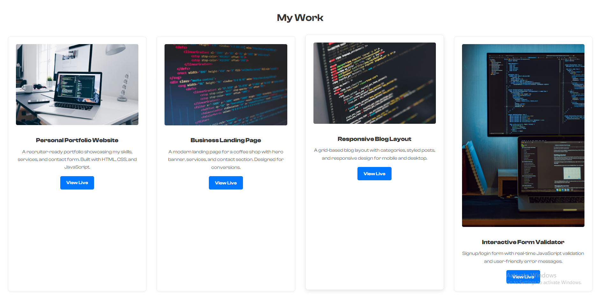

# 🌐 Personal Portfolio Website

A minimalist, responsive portfolio website built with **HTML, CSS, and JavaScript**.  
This project showcases my skills, services, and projects, and includes a working contact form.

---

## 🚀 Live Demo

👉 [View Website](https://portfolio-lac-rho-5zxoj2o3ig.vercel.app/)

---

## 📸 Screenshots

### Home Page



### Portfolio Section



---

## 📌 Features

- Responsive design (mobile-first)
- Hero, About, Services, Portfolio, Contact sections
- Interactive contact form with validation
- SEO meta tags + favicon
- Hosted on Netlify/GitHub Pages

---

## 🛠️ Technologies Used

- **HTML5** → semantic structure
- **CSS3** → Flexbox/Grid, responsive design
- **JavaScript** → form validation, interactivity

---

## 📂 Project Structure

index.html
style.css
script.js
assets/

Code

---

## 📖 How to Run Locally

1. Clone this repo:
   ```bash
   git clone https://github.com/Momna533/portfolio
   Open index.html in your browser.
   ```

Customize content in index.html, styles in style.css, and scripts in script.js.

📧 Contact
Created by Momna Ijaz  
Frontend Developer & Freelancer

Email: [Your Email](momnadev533gb@gmail.com)
